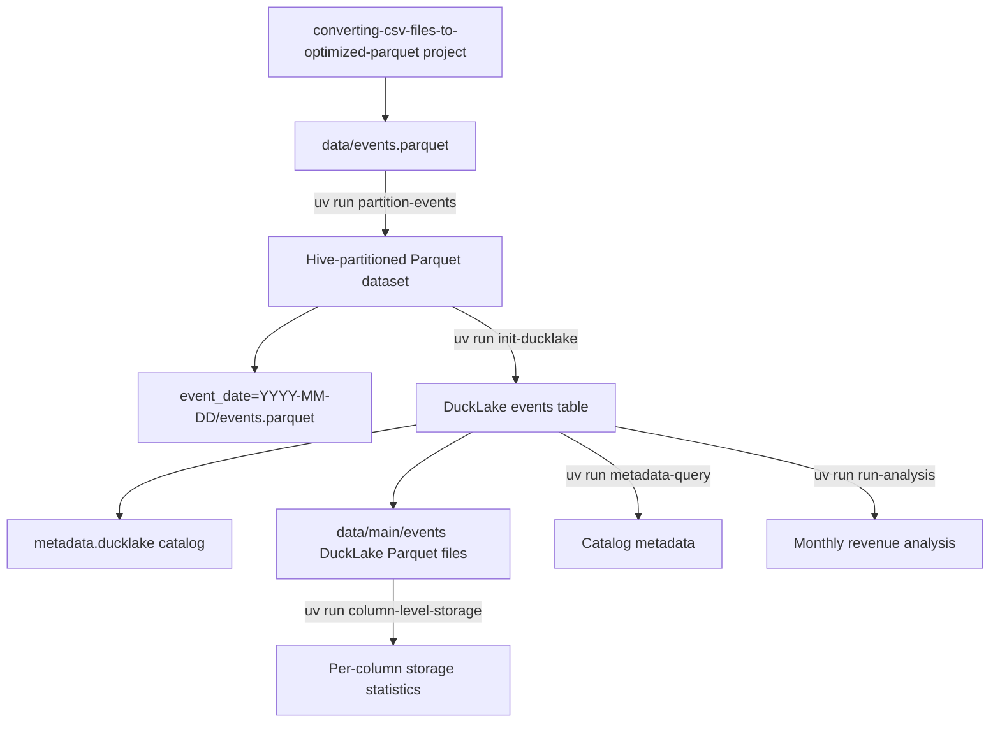

# Moving Large Numbers of Rows to DuckLake

This project demonstrates an end-to-end workflow for loading a large Parquet
dataset into [DuckLake](https://ducklake.select) with
[DuckDB](https://duckdb.org). It partitions a 100-million-row source file,
loads the partitioned data into a DuckLake catalog, inspects catalog and
physical storage metadata, and runs an analytical query while recording
resource usage.

## Data provenance

`data/events.parquet` was copied from the separate
`converting-csv-files-to-optimized-parquet` project. That project produced the
optimized single-file Parquet dataset from CSV input; this repository starts
with that Parquet file and focuses on partitioning it and moving its rows into
DuckLake.

The source file is approximately 946 MB and contains 100,000,000 event rows:

| Column | Type | Description |
| --- | --- | --- |
| `event_date` | `DATE` | Event date, from 2024-01-01 through 2026-01-31 |
| `country` | `VARCHAR` | Country code |
| `channel` | `VARCHAR` | Acquisition or sales channel |
| `user_id` | `INTEGER` | User identifier |
| `order_id` | `INTEGER` | Order identifier |
| `revenue` | `DOUBLE` | Event revenue |

Dataset cardinality relevant to partition selection:

- 762 distinct event dates
- 6 countries
- 4 channels
- Approximately 131,234 rows per date on average

## Architecture



The intermediate directory retains the historical name
`data/base_flowlogs_partitioned`, but its contents are event data, not VPC flow
logs.

## Requirements

- [uv](https://docs.astral.sh/uv/)
- Python 3.13 or newer (managed automatically by uv when needed)
- Network access the first time DuckDB installs the DuckLake extension
- Enough free disk space for the source file, partitioned copy, and
  DuckLake-managed copy

Install/synchronize the environment from the project root:

```sh
uv sync
```

Core dependencies are DuckDB, pandas, NumPy, and psutil. Versions are locked in
`uv.lock`.

## Quick start

Run all commands from the repository root because the programs use paths
relative to the current working directory.

```sh
# 1. Create the Hive-partitioned intermediate dataset
uv run partition-events

# 2. Create/attach the DuckLake catalog and ingest the events table
uv run init-ducklake

# 3. Inspect the catalog
uv run metadata-query

# 4. Inspect physical Parquet storage by column
uv run column-level-storage

# 5. Run the monthly revenue analysis
uv run run-analysis
```

## Commands and implementation details

### `partition-events`

Entry point:
`moving_large_number_rows_to_ducklake.partition_events:main`

Converts `data/events.parquet` into a Hive-partitioned Parquet dataset using
DuckDB's `COPY ... PARTITION_BY`. The default layout is:

```text
data/base_flowlogs_partitioned/
├── event_date=2024-01-01/
│   └── events.parquet
├── event_date=2024-01-02/
│   └── events.parquet
└── ...
```

`event_date` is omitted from each physical Parquet file and encoded in its
folder name. DuckDB reconstructs it as a `DATE` when files are read with
`hive_partitioning = true`.

The write uses two phases:

1. DuckDB performs a parallel partitioned write with insertion-order
   preservation disabled.
2. The program consolidates each partition's per-thread chunks into one
   `events.parquet` file.

The consolidation prevents the small-files problem. For this dataset, the raw
parallel write produced 131,936 files; consolidation reduces that to one file
per date, or 762 files total.

The program verifies that input and output row counts match and prints
partition count, file count, output size, elapsed time, CPU time, memory, and
disk I/O.

Options:

| Option | Default | Description |
| --- | --- | --- |
| `--input PATH` | `data/events.parquet` | Source Parquet file |
| `--output PATH` | `data/base_flowlogs_partitioned` | Output dataset directory |
| `-p COLUMN`, `--partition-by COLUMN` | `event_date` | Partition column; repeat to create nested partitions |
| `--overwrite` | disabled | Delete a non-empty output directory before writing |

Examples:

```sh
# Replace the existing default output
uv run partition-events --overwrite

# Use nested country/channel partitions in a separate directory
uv run partition-events \
  --output data/events_by_country_channel \
  -p country \
  -p channel
```

Use high-cardinality partition combinations carefully. Partitioning by date,
country, and channel together could create many small partitions.

### `init-ducklake`

Entry point:
`moving_large_number_rows_to_ducklake.init_ducklake:main`

This command:

1. Connects to an in-process DuckDB database.
2. installs and loads the DuckLake extension.
3. Attaches `ducklake:metadata.ducklake` as `my_lake` with `DATA_PATH 'data'`.
4. Switches the active catalog to `my_lake`.
5. Creates the `events` table from the Hive-partitioned files.
6. Prints wall-clock, CPU, memory, and disk-I/O metrics using psutil.

The ingestion query is equivalent to:

```sql
CREATE TABLE IF NOT EXISTS events AS
SELECT *
FROM read_parquet(
    'data/base_flowlogs_partitioned/**/*.parquet',
    hive_partitioning = true,
    union_by_name = true
);
```

`CREATE TABLE IF NOT EXISTS` makes repeated executions safe, but it also means
rerunning the command does not refresh an existing table after the source files
change. Drop or replace `events` first when a full reload is required.

DuckLake writes its own table files under `data/main/events/`. These are
separate from both the original `data/events.parquet` file and the partitioned
intermediate dataset.

### `metadata-query`

Entry point:
`moving_large_number_rows_to_ducklake.metadata_query:main`

Attaches the DuckLake catalog and prints pandas tables containing:

- All attached database catalogs from `duckdb_databases()`
- Tables managed by the `my_lake` catalog from `duckdb_tables()`

Run it after `init-ducklake`:

```sh
uv run metadata-query
```

### `column-level-storage`

Entry point:
`moving_large_number_rows_to_ducklake.column_level_storage:main`

Reports physical storage statistics for the DuckLake-managed event Parquet
files using:

```sql
parquet_metadata('data/main/events/*.parquet')
```

It reports, per column and compression/type combination:

- Physical Parquet type
- Compression codec
- Number of files
- Number of values
- Compressed size in MB
- Uncompressed size in MB
- Compressed size as a percentage of uncompressed size

DuckLake tables are backed by Parquet rather than native DuckDB blocks. For
that reason, `pragma_storage_info('events')` is not used: it returns no native
storage segments for this table, and DuckDB 1.5 does not expose the old
`total_blocks` column assumed by earlier versions of this script.

Run it after `init-ducklake`:

```sh
uv run column-level-storage
```

The command expects DuckLake files at `data/main/events/*.parquet` and exits
with an explanatory message if none are present.

### `run-analysis`

Entry point:
`moving_large_number_rows_to_ducklake.run_analysis:run_analysis`

Attaches the catalog read-only and calculates monthly revenue:

```sql
SELECT
    YEAR(event_date) AS event_year,
    MONTH(event_date) AS event_month,
    ROUND(SUM(revenue), 2) AS total_revenue
FROM events
GROUP BY event_year, event_month
ORDER BY event_year DESC, event_month DESC;
```

The command prints the results plus wall-clock execution time, user and system
CPU time, and peak resident memory when the operating system provides Python's
`resource` module.

```sh
uv run run-analysis
```

### Default package command

```sh
uv run moving-large-number-rows-to-ducklake
```

This invokes `moving_large_number_rows_to_ducklake:main`, which currently only
prints a placeholder greeting. It is not part of the data pipeline.

## Files and directories

```text
.
├── data/
│   ├── events.parquet                     # Copied source dataset
│   ├── base_flowlogs_partitioned/         # Hive-partitioned intermediate data
│   └── main/events/                       # DuckLake-managed Parquet files
├── src/moving_large_number_rows_to_ducklake/
│   ├── __init__.py                        # Placeholder package command
│   ├── partition_events.py                # Partition and consolidate source data
│   ├── init_ducklake.py                   # Initialize and populate DuckLake
│   ├── metadata_query.py                  # Catalog/table inspection
│   ├── column_level_storage.py            # Physical column-size inspection
│   └── run_analysis.py                    # Monthly revenue query and metrics
├── metadata.ducklake                      # DuckLake metadata catalog
├── pyproject.toml                         # Package config and console scripts
├── uv.lock                                # Locked dependencies
└── README.md
```

## Generated artifacts

| Path | Role | Generated by |
| --- | --- | --- |
| `data/events.parquet` | Source dataset copied from `converting-csv-files-to-optimized-parquet` | External project/manual copy |
| `data/base_flowlogs_partitioned/` | Hive-partitioned intermediate dataset | `partition-events` |
| `metadata.ducklake` | DuckLake metadata catalog | `init-ducklake` |
| `data/main/events/*.parquet` | DuckLake-managed table data | `init-ducklake` |

The current `.gitignore` ignores Python build products and `.venv`, but it does
not ignore these data/catalog artifacts. Review staged files before committing
large generated files.

## Reference results

Observed on the author's machine using local storage and a warm filesystem
cache. Results vary by CPU, storage, DuckDB version, cache state, and existing
catalog state.

| Operation | Rows | Wall time | Peak RAM | Result |
| --- | ---: | ---: | ---: | --- |
| Partition and consolidate | 100,000,000 | ~43.5 s | ~1.05 GB | 762 partitions/files, ~1.07 GB |
| Initial DuckLake ingestion | 100,000,000 | ~2.8 s | ~517 MB | Two DuckLake Parquet files observed |
| Monthly revenue analysis | 100,000,000 | ~193 ms | ~129 MB | 25 monthly groups |

The fast recorded ingestion time was measured with a warm page cache and should
not be treated as a portable benchmark.

## Troubleshooting

### `events.parquet` is missing

Copy it from the `converting-csv-files-to-optimized-parquet` project into:

```text
data/events.parquet
```

Then run `uv run partition-events`.

### The partition output directory is not empty

The partition command refuses to mix new and old files. Explicitly replace it:

```sh
uv run partition-events --overwrite
```

### `events` does not exist

Initialize the catalog first:

```sh
uv run init-ducklake
```

### DuckLake extension installation fails

DuckDB downloads the extension on first use. Confirm network access and retry.
After installation, DuckDB can load the locally cached extension.

### Analysis reports missing columns

The analysis expects the event schema documented above. If an older flowlog
catalog exists, remove or relocate that catalog/data and run the event pipeline
again. The current analysis derives year and month from `event_date` and sums
`revenue`; it does not use legacy flowlog columns such as `year`, `month`, or
`byt`.

### Column storage reports no files

Run `uv run init-ducklake` first and confirm that
`data/main/events/*.parquet` exists. The storage command inspects the
DuckLake-managed copy, not the partitioned intermediate files.
